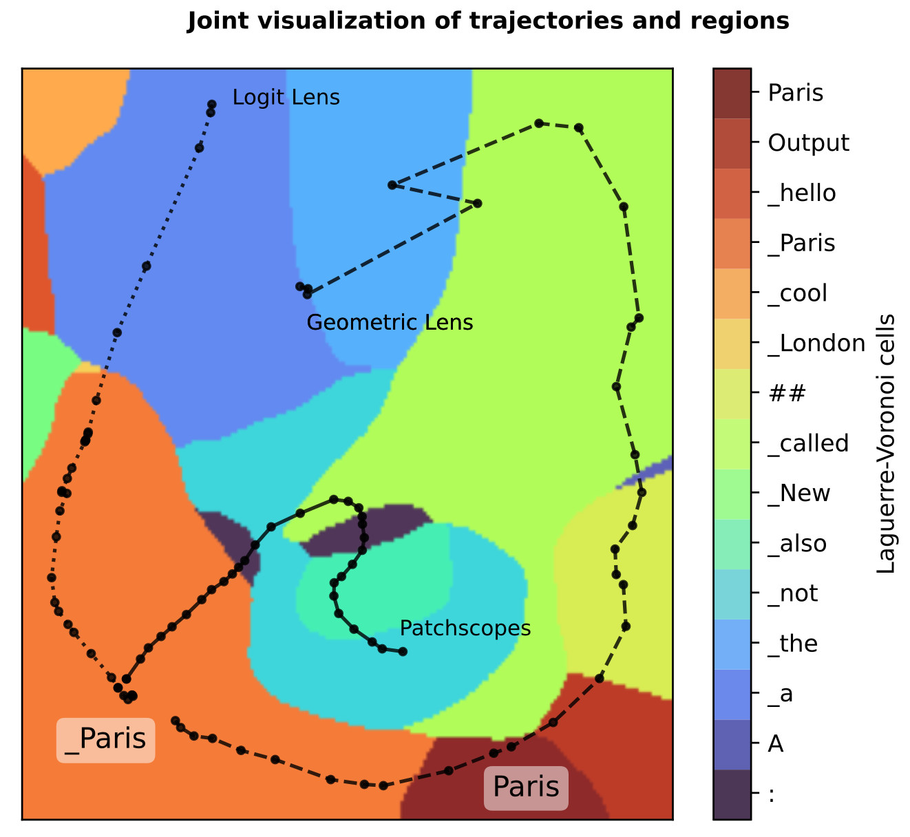
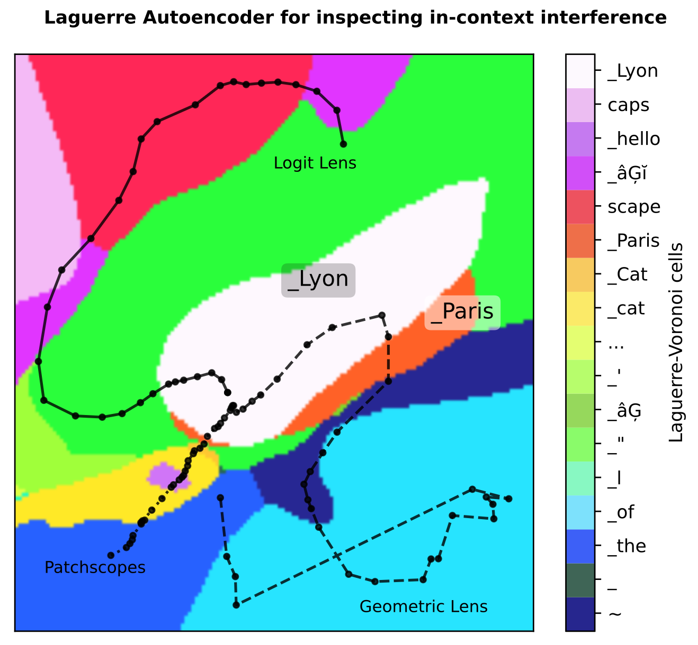

# Joint visualization of LLM decision boundaries and reasoning trajectories by Geometric Lens and Laguerre Geometry

<div align="center">

</div>
<div align="center">

</div>

### Installation
```bash
pip install numpy torch transformers accelerate
```

### Hidden representation readout and visualization
1. Run Logit Lens: \
01_logit_lens_and_patchscopes.ipynb
2. Run Patchscopes: \
01_logit_lens_and_patchscopes.ipynb
3. Run Geometric Lens (ours): \
02_geometric_lens.ipynb
4. Compare all lenses in 2D: \
03_boundary_trajectory_visualization.ipynb

### Reproducing Anthropic's Jacobian Lens
Follow [jacobian-lens](https://github.com/anthropics/jacobian-lens).

### References
[arXiv](https://arxiv.org/abs/2607.10578)
```tex
@misc{ma2026laguerregeometryinterpretinglarge,
      title={Laguerre Geometry for Interpreting Large Language Models}, 
      author={Chunwei Ma and Russell Wolfinger},
      year={2026},
      eprint={2607.10578},
      archivePrefix={arXiv},
      primaryClass={cs.AI},
      url={https://arxiv.org/abs/2607.10578}, 
}
```
